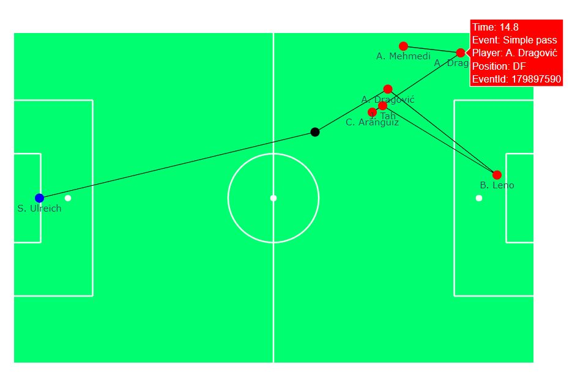
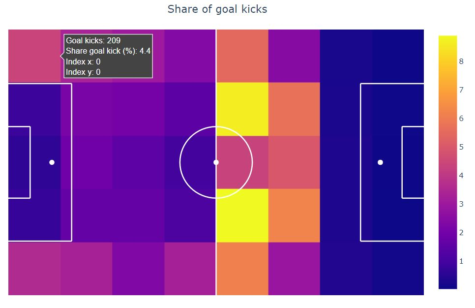

# Soccer analytics

`soccer_analytics` is a Python project trying to facilitate and being a starting point for analytics projects in soccer. 

* Extensive number of helper functions for visualization and animation of soccer events
* Calculation of relevant soccer KPIs for event data (tracking data to come)
* Pre-proccessed [wyscout](https://figshare.com/collections/Soccer_match_event_dataset/4415000/2) event data allows you to dive into the analyses immediately 
* Detailed tutorials in form of notebooks that help you get started with this project and soccer analytics in general
* Thought of as a starting point for projects rather than a "hidden" library
* Set up in a way so that functions are easily extendable
* All plots and animations are created with [plotly](https://plotly.com/python/) and therefore easily integretable into [dash](https://plotly.com/dash/) dashboards
* Supports python 3.6 - 3.8

## Tutorial
This projects includes a number of notebooks that serve as tutorial on how to use the helper functions and might be a good starting point into soccer analytics in general.
The notebooks can be found [here](notebooks) and I recommend to go through them in the following order:

1. [Exploratory analysis event data](notebooks/exploratory_analysis_event_data.ipynb): This notebook gives you an overview over the pre-processed wyscout data that we are going to use 
and run rudimentary exploratory analysis using pandas-profiling

2. [Goal kick analysis](notebooks/goal_kick_analysis.ipynb): In this notebook we analyse goal kicks made in the Bundesliga. On the way we learn how to
    - Use bar plots in plotly
    - Visualize events on a soccer field through graphs and animations
    - Draw heatmaps on a soccer field

3. [Passing analysis](notebooks/passing_analysis.ipynb): We continue our journey but looking at passes between players and analyze one match in more detail. Technically, we learn how to 
    use the helper function to:
    - Compute statistics efficiently
    - Draw position plots of players
    - Visualize passing lines and passing zones

4. [Expected goal model with logistic regression](notebooks/expected_goal_model_lr.ipynb): While in the previous notebooks it was mostly about visualization, in this notebook we start 
looking into machine learning. We jointly build an expected goal model using logistic regression and learn about fundamentals of machine learning, e.g.:
    - Feature engineering 
    - Multivariate analysis
    - Metrics
    - Model interpretation

5. [Challenges using gradient boosters](notebooks/challenges_with_gradient_boosters.ipynb): In this rather technical notebook we are going to look into some of the challenges that often 
arise when using gradient boosters such as lightGBM or XGBoost in real-life situations and how to potentially overcome most of 
them. Challenges include:
    - Overfitting
    - Feature interpretation
    - Monotonicity
    - Extrapolation

## Examples

### Event visualisation
<!-- .element height="20%" width="20%" -->
### Heatmap
<!-- .element height="20%" width="20%" -->
    

## Installation
If you are new to Python and soccer analytics I would recommend to you to download [Anaconda distribution](https://www.anaconda.com/distribution/#download-section) and follow 
the instruction under [Conda](#Conda)

### Conda
1. Open the Anaconda Prompt and cd to the project folder
2. Create a new conda environment "soccer_analytics"\
`conda create -n soccer_analytics python=3.6`
3. Activate the conda environment\
`conda activate soccer_analytics`
4. Install all required packages\
`pip install -r requirements.txt`

## Acknowledgements
[wyscout data](https://figshare.com/collections/Soccer_match_event_dataset/4415000/2)
