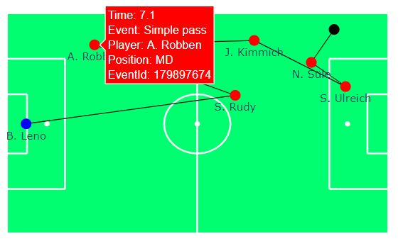

# Soccer analytics

`soccer_analytics` is a Python project trying to facilitate and being a starting point for analytics projects in soccer. 

* Extensive number of helper functions for visualization and animation of soccer events
* Calculation of relevant soccer KPIs for both event and positioning data
* Pre-proccessed [wyscout](https://figshare.com/collections/Soccer_match_event_dataset/4415000/2) event data allows you to dive into the analyses immediately 
* Detailed tutorials in form of notebooks that help you get started with this project and soccer analytics in general
* Thought of a starting point for projects rather than a "hidden" library
* Set up in a way so that functions are easily extendable
* All plots and animations are created with [plotly](https://plotly.com/python/) and therefore easily integretable into [dash](https://plotly.com/dash/) dashboards
* Supports python 3.6

## Examples

### Event visualisation
<!-- .element height="20%" width="20%" -->
### Heatmap
<!-- .element height="20%" width="20%" -->

## Tutorial
This projects includes a number of notebooks that serve as tutorial on how to use the helper functions and might be a good starting point into soccer analytics in general.
The notebooks can be found [here](notebooks) and I recommend to go through them in the following order:

1. [Exploratory analysis event data](notebooks/exploratory_analysis_event_data.ipynb): This notebook gives you an overview over the pre-processed wyscout data that we are going to use 
and run rudimentary exploratory analysis using pandas-profiling
2. [Goal kick analysis](notebooks/goal_kick_analysis.ipynb): In this notebook we analyse goal kicks made in the Bundesliga. On the way we learn how to
    - Use bar plots in plotly
    - Visualize events on a soccer field through graphs and animations
    - Draw heatmaps on a soccer field
  

## Installation
If you are new to Python and soccer analytics I would recommend to you to download [Anaconda distribution](https://www.anaconda.com/distribution/#download-section) and follow 
the instruction under [Conda](#Conda)

### Conda
1. Open the Anaconda Prompt and cd to the project folder
2. Create a new conda environment "soccer_analytics"\
`conda create -n soccer_analytics python=3.6`
3. Activate the conda environment\
`conda activate soccer_analytics`
4. Install all required packages\
`pip install -r requirements.txt`

## FAQs
**Q:** Most of the notebooks use data of the German Bundesliga. Can I also use other leagues?

**A:** Yes, this is possible! However, you will need to run the pre-processing yourself before being able 
to use the data in the notebooks. Just follow these steps:
1. Download the [wyscout data](https://figshare.com/collections/Soccer_match_event_dataset/4415000/2)
2. Unzip it and save it under data/raw_data/wyscout data , i.e. there should be *players.json* 
and *teams.json* as well as two folders *events* and *matches* with the event data and match data, respectively.
3. Set your league in the [wyscout_cleansing_pipeline.py](preprocessing/cleaning_wyscout_data/wyscout_cleansing_pipeline.py) script under *preprocessing/cleaning_wyscout_data* and run it
4. Once the script ran, you should see additional files in the *data* folder that you can use in the notebooks

## Acknowledgements

