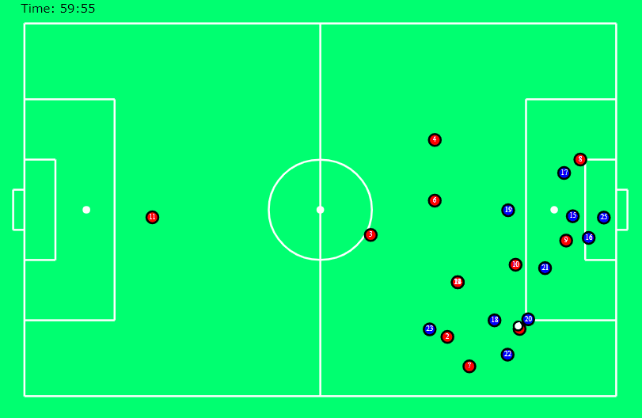
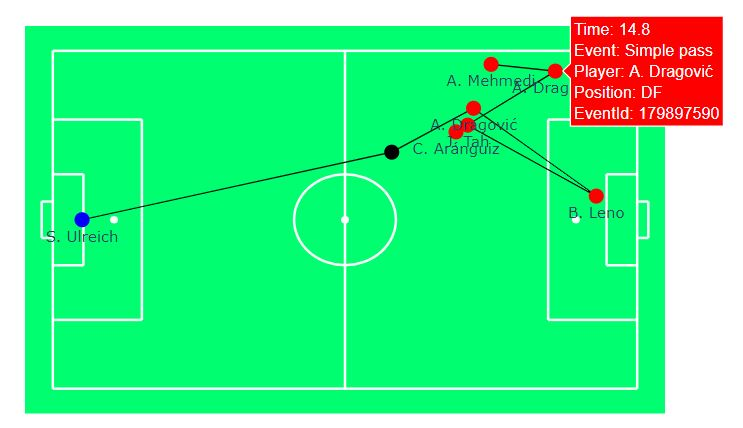
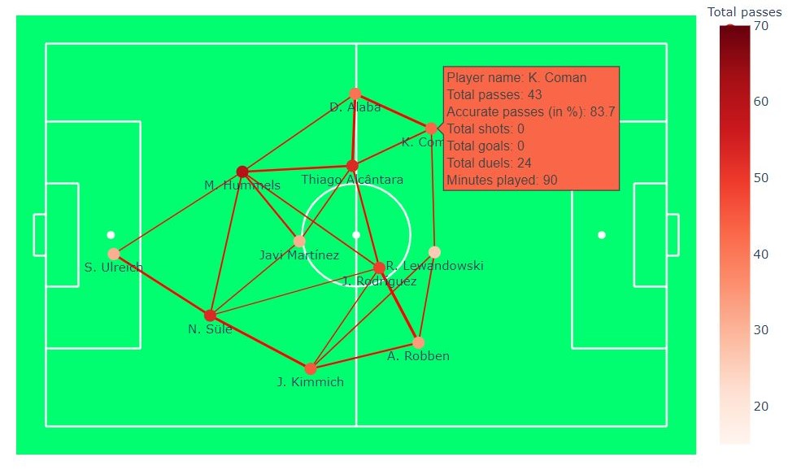
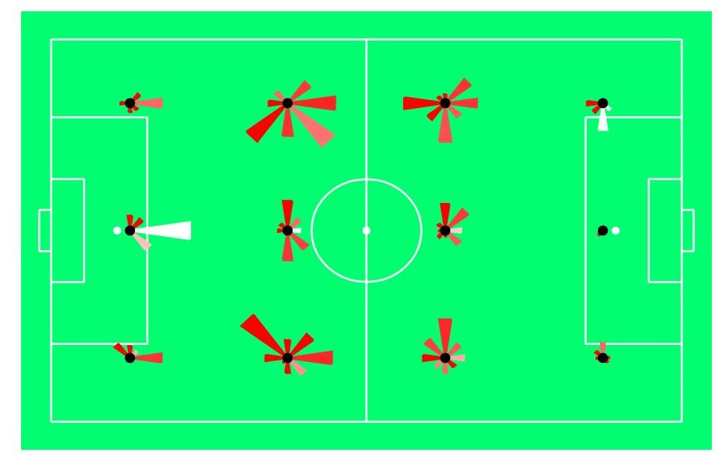

# Soccer analytics

`soccer_analytics` is a Python project trying to facilitate and being a starting point for analytics projects in soccer. 

* Extensive number of helper functions for visualization and animation of soccer events
* Calculation of relevant soccer KPIs for event data and tracking data
* Pre-proccessed [wyscout](https://figshare.com/collections/Soccer_match_event_dataset/4415000/2) event data and [Metrica](https://github.com/metrica-sports/sample-data) tracking data allows you to dive into the analyses immediately 
* Detailed tutorials in form of notebooks that help you get started with this project and soccer analytics in general
* Thought of as a starting point for projects rather than a "hidden" library
* Set up in a way so that functions are easily extendable
* All plots and animations are created with [plotly](https://plotly.com/python/) and therefore easily integretable into [dash](https://plotly.com/dash/) dashboards
* Supports python 3.6 - 3.8

## Tutorial
This projects includes a number of notebooks that serve as tutorial on how to use the helper functions and might be a good starting point into soccer analytics in general.
The notebooks can be found [here](notebooks) and I recommend to go through them in the following order:

1. [Exploratory analysis event data](notebooks/exploratory_analysis_event_data.ipynb): This notebook gives you an overview over the pre-processed wyscout data 
and runs rudimentary exploratory analysis using pandas-profiling

2. [Goal kick analysis](notebooks/goal_kick_analysis.ipynb): In this notebook we identify the best teams w.r.t goal kicks in the Bundesliga. On the way we learn how to
    - Use bar plots in plotly
    - Visualize events on a soccer field through graphs and animations
    - Draw heatmaps on a soccer field

3. [Passing analysis](notebooks/passing_analysis.ipynb): We continue our journey by looking at passes between players and analyze one match in more detail. Technically, we learn how to 
    use the helper function to:
    - Compute statistics efficiently
    - Draw position plots of players
    - Visualize passing lines and passing zones

4. [Expected goal model with logistic regression](notebooks/expected_goal_model_lr.ipynb): While in the previous notebooks it was mostly about visualization, in this notebook we start 
looking into machine learning. We jointly build an expected goal model using logistic regression and learn about fundamentals of machine learning, e.g.:
    - Feature engineering 
    - Multivariate analysis
    - Metrics
    - Model interpretation

5. [Challenges using gradient boosters](notebooks/challenges_with_gradient_boosters.ipynb): In this rather technical notebook we are going to look into some of the challenges that often 
arise in real-life situations when using gradient boosters such as lightGBM or XGBoost, such as:
    - Overfitting
    - Feature interpretation
    - Monotonicity
    - Extrapolation

6. [Introduction to tracking data](notebooks/introduction_to_tracking_data.ipynb): In this notebook we are going to start looking into tracking data provided by Metrica sports. We learn 
about the fundamentals of working with tracking data such as:
    - Visualizing tracking data in animations
    - Computing basic statistics based on tracking data
    - Adding helper tools to highlight certain aspects in animations
    - Deep-dive into *packing*

## Examples

### Tracking data visualization

### Event visualisation
<!-- .element height="20%" width="20%" -->
### Heatmap
<!-- .element height="20%" width="20%" -->
### Passing map
<!-- .element height="15%" width="15%" -->
### Polar charts   
<!-- .element height="15%" width="15%" -->

## Installation
If you are new to Python and soccer analytics, I would recommend you to download the [Anaconda distribution](https://www.anaconda.com/distribution/#download-section) and follow 
the instructions under [Conda](#Conda).

### Conda
1. Open the Anaconda Prompt and cd to the project folder
2. Create a new conda environment "soccer_analytics"\
`conda create -n soccer_analytics python=3.7`
3. Activate the conda environment\
`conda activate soccer_analytics`
4. Install all required packages\
`pip install -r requirements.txt`

## Acknowledgements

### Data sources
Event data: [Wyscout](https://figshare.com/collections/Soccer_match_event_dataset/4415000/2)

Tracking data: [Metrica](https://github.com/metrica-sports/sample-data)

### Code
Great repositority on how to read in tracking data by Laurie Shaw [here](https://github.com/Friends-of-Tracking-Data-FoTD/LaurieOnTracking)
